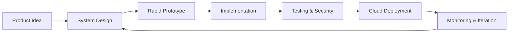

<div align="center">

  

  <h1>Mudassir Khan</h1>
  <h3>AI-Native Full-Stack Engineer · Web3 Builder · Systems Thinker</h3>

  <p>
    Designing intelligent digital products at the intersection of
    <strong>AI</strong>, <strong>distributed systems</strong>,
    <strong>Web3</strong>, and <strong>modern web engineering</strong>.
  </p>

  <p>
    <a href="https://mudassirkhan.me/"></a>
    <a href="https://www.linkedin.com/in/mudassir-khan-84a91415b/"></a>
    <a href="https://bmd-apes-minting.web.app"></a>
  </p>

  <p>
    
    
  </p>

</div>

---

## `> whoami`

```typescript
const developer = {
  name: "Mudassir Khan",
  role: "AI-Native Full-Stack & Web3 Engineer",
  location: "Pakistan",
  mindset: ["Build", "Measure", "Learn", "Iterate"],
  currentFocus: [
    "AI-powered product experiences",
    "Scalable full-stack architectures",
    "Smart contracts and decentralized applications",
    "Agentic workflows and developer automation",
  ],
  learning: [
    "Rust",
    "Applied cryptography",
    "LLM orchestration",
    "Advanced EVM patterns",
    "Distributed systems",
  ],
};
```

I build products that combine reliable engineering with thoughtful user experience. My work spans frontend systems, backend architecture, cloud infrastructure, smart contracts, and AI-assisted workflows.

I am especially interested in transforming complex technologies into products that feel fast, intuitive, secure, and useful.

---

## Engineering Focus

<table>
  <tr>
    <td width="50%" valign="top">
      <h3>🧠 AI-Native Systems</h3>
      <p>Building context-aware applications using LLM orchestration, retrieval pipelines, structured outputs, tool calling, and intelligent workflow automation.</p>
    </td>
    <td width="50%" valign="top">
      <h3>⛓️ Web3 Engineering</h3>
      <p>Developing decentralized applications, wallet-based experiences, smart contract integrations, token systems, and EVM-compatible product flows.</p>
    </td>
  </tr>
  <tr>
    <td width="50%" valign="top">
      <h3>⚡ Full-Stack Platforms</h3>
      <p>Creating scalable applications with modern React architecture, typed APIs, server-side rendering, event-driven services, and modular backend systems.</p>
    </td>
    <td width="50%" valign="top">
      <h3>☁️ Cloud & Infrastructure</h3>
      <p>Designing serverless backends, containerized services, CI/CD pipelines, observability layers, and cloud-native deployment workflows.</p>
    </td>
  </tr>
</table>

---

## Technology Matrix

### Core Engineering

<p></p>

### Data, APIs & State

<p></p>

### Infrastructure & Tooling

<p></p>

### Product & Interface Engineering

<p></p>

---

## System Design Philosophy

```text
Product Intent
     │
     ▼
User-Centered Interface
     │
     ▼
Typed Application Layer
     │
     ├── AI Orchestration
     ├── Smart Contract Integration
     ├── API & Event Workflows
     └── Authentication & Authorization
     │
     ▼
Data, Infrastructure & Observability
```

My preferred engineering principles:

- **Architecture with intent** — every abstraction should solve a real problem.
- **Type safety across boundaries** — reduce uncertainty between UI, APIs, and data.
- **Composable systems** — design modules that evolve without slowing the product.
- **Secure by design** — treat permissions, validation, and key management as core architecture.
- **Observability first** — systems should explain their behavior through useful telemetry.
- **Progressive decentralization** — use blockchain where trust and ownership genuinely matter.
- **Human-centered AI** — intelligent features should improve decisions, not create more friction.

---

## AI Engineering Interests

```yaml
ai_systems:
  orchestration:
    - agentic workflows
    - tool calling
    - structured generation
    - multi-step reasoning pipelines

  knowledge:
    - retrieval augmented generation
    - semantic search
    - vector databases
    - context engineering

  reliability:
    - output validation
    - evaluation pipelines
    - guardrails
    - tracing and observability

  product_layer:
    - intelligent interfaces
    - workflow automation
    - human-in-the-loop systems
    - AI-assisted developer tools
```

---

## Web3 Engineering Interests

```yaml
web3:
  application_layer:
    - wallet authentication
    - transaction lifecycle UX
    - on-chain and off-chain synchronization
    - decentralized application architecture

  smart_contracts:
    - EVM development
    - contract composability
    - access control
    - upgrade and deployment strategies

  security:
    - signature verification
    - replay protection
    - secure key handling
    - common smart contract vulnerabilities

  research:
    - applied cryptography
    - account abstraction
    - zero-knowledge systems
    - decentralized identity
```

---

## Current Direction

- Building intelligent product experiences powered by modern AI workflows.
- Exploring agentic systems that can reason, call tools, and execute structured tasks.
- Developing deeper expertise in Rust, cryptography, and secure systems programming.
- Studying advanced EVM patterns and scalable decentralized architectures.
- Improving application reliability through testing, tracing, and observability.
- Creating reusable architecture for high-performance full-stack products.

---

## Featured Project

<div align="center">

### BMD Apes Minting Platform

A Web3-focused minting experience combining wallet interactions, smart contract connectivity, and a responsive product interface.

<a href="https://bmd-apes-minting.web.app"></a>

</div>

---

## Development Workflow



---

## GitHub Intelligence

<div align="center">
  
  
</div>

<div align="center">
  
  
</div>

> GitHub language statistics represent public repository activity and do not necessarily reflect my complete technical experience.

---

## Beyond the Code

I care about more than making software work. I care about how systems behave under pressure, how easily teams can extend them, and how naturally users can interact with them.

The goal is simple:

```text
Build technology that feels advanced underneath
and effortless on the surface.
```

---

## Let's Build Something Meaningful

I am interested in collaborating on ambitious products involving:

- AI-powered applications and developer tools
- Web3 platforms and decentralized experiences
- SaaS products and cloud-native systems
- Smart contract integrations
- High-performance frontend applications
- Experimental technology with real product value

<div align="center">
  <a href="https://mudassirkhan.me/"></a>
  <a href="https://www.linkedin.com/in/mudassir-khan-84a91415b/"></a>

  <br /><br />

  <sub>Engineered with curiosity, precision, and a bias toward shipping.</sub>
</div>
